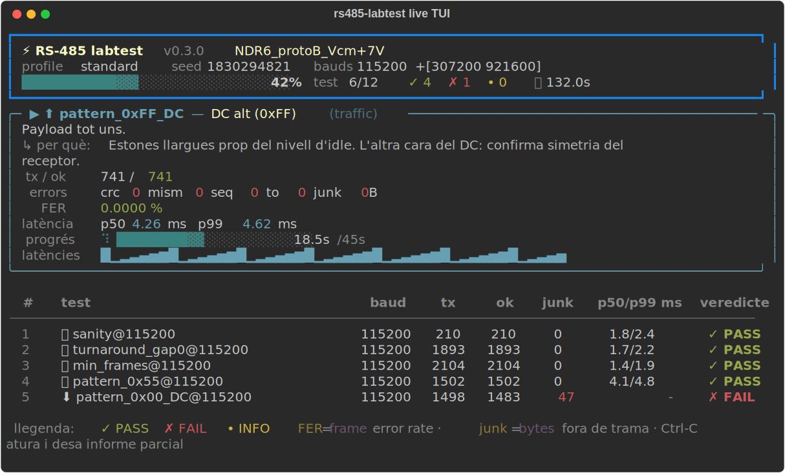

# rs485-labtest

Bateria d'estres *laboratory-grade* per a links **RS-485 half-duplex** — pensada
per validar convertidors RS-485 ↔ fibra optica (NDR6) i per a control de
qualitat d'entrada d'altres equips. Criteris PASS/FAIL explicits i informes
reproduibles (JSON + Markdown + CSV de latencies).

## El banc

```
[PC] --USB--> [adaptador A] --RS485--> [NDR6 #1] ==fibra==> [NDR6 #2] --RS485--> [adaptador B] --USB--> [PC]
                (master)                                                              (slave, fa eco)
```

Els dos extrems poden penjar del mateix PC: el mode `duo` ho orquestra tot sol.
Muntatge detallat del banc: [docs/SETUP.md](docs/SETUP.md).

## Instal·lacio

```bash
git clone <repo> && cd rs485-labtest
pip install -e .
rs485-labtest --help
```

Requereix Python ≥ 3.9. L'unica dependencia es `pyserial`.

## Quickstart (mode `duo`, tot des d'un PC)

```bash
rs485-labtest duo \
    --port /dev/serial/by-id/usb-FTDI_ADAPTADOR_A-if00-port0 \
    --slave-port /dev/serial/by-id/usb-FTDI_ADAPTADOR_B-if00-port0 \
    --profile smoke --label "NDR6_protoB_Vcm+0V" --outdir results/
```

> Feu servir sempre noms `/dev/serial/by-id/`: els `ttyUSBn` ballen entre
> replugs i podeu acabar testejant el link al reves.

Sortida tipica:

```
=== BATERIA RS-485 v0.3.0 === label=NDR6_protoB_Vcm+0V profile=smoke seed=1830294821
    18 tests | resultats a results/rs485_NDR6_protoB_Vcm+0V_20260713T083000Z.*

[ 1/18] sanity@115200                PASS tx=210 ok=210 p50=1.8ms p99=2.4ms
[ 2/18] turnaround_gap0@115200       PASS tx=1893 ok=1893 p50=1.7ms p99=2.2ms
...
[ 9/18] idle_monitor@115200          PASS tx=0 ok=0
[10/18] collision_blind@115200       INFO tx=1420 ok=0 | test de colisio: vegeu post_collision
[11/18] post_collision@115200        PASS tx=5 ok=5 p50=1.9ms p99=2.1ms
[12/18] ber_random_long@115200       PASS tx=641 ok=641 p50=13.2ms p99=14.0ms
[13/18] baud_offset+1%@115200        PASS tx=163 ok=163 p50=1.9ms p99=2.3ms
...
[17/18] baud_offset+3%@115200        INFO tx=16 ok=0 | desajust +3.0%: FER 100.00% (caracteritzacio del marge)

=== RESULTAT GLOBAL: PASS (0 FAIL / 18 tests, 128.6s) ===
```

Codi de sortida: `0` si tot PASS, `1` si hi ha cap FAIL o la corrida
s'interromp (Ctrl-C genera igualment l'informe parcial).

## Feedback en directe (TUI)

Quan corres en un terminal interactiu, la bateria mostra una vista **en viu**
que s'actualitza in-place: barra de progrés global amb el recompte
PASS/FAIL, el **test en curs** amb els seus comptadors, FER, p50/p99 i un
**sparkline de latències** que batega en temps real, i la taula de tests ja
completats amb el veredicte de color.



Es controla amb `--live`:

| Valor | Comportament |
|---|---|
| `auto` (per defecte) | TUI si hi ha terminal interactiu; si no (pipe, CI, log), sortida línia a línia |
| `rich` | força la TUI |
| `plain` | força la sortida línia a línia clàssica (la de sempre) |

El mode `--quiet` no mostra res per consola (només genera els fitxers). El
mostrar en directe **no afecta les latències mesurades**: el refresc es
dispara sempre *després* de cronometrar cada RTT, mai durant, i està escanyat
a ~5 refrescos/s.

## Assistent interactiu

Si no vols recordar flags, llança l'assistent i respon les preguntes (mode,
ports —amb detecció automàtica—, bauds, quins tests, etiqueta, criteris…):

```bash
rs485-labtest wizard
```

Munta la mateixa comanda que faries a mà i, després d'un resum, la llança.

## Modes

| Mode | Funcio |
|---|---|
| `wizard` | assistent interactiu: pregunta i llança |
| `slave` | escolta i fa eco; obeeix el canvi de baud remot (CMD_BAUD) |
| `master` | test individual manual amb parametres lliures |
| `battery` | bateria automatitzada de 13 tests (18 corrides) + informes |
| `duo` | arrenca el `slave` com a subproces i corre la `battery` des d'un sol PC |

Cada test s'explica pel camí (què fa i per què) tant a la TUI com en mode pla.
Pots triar un subconjunt amb `--tests` (per defecte, tots):

```bash
rs485-labtest duo --port ... --slave-port ... \
    --tests sanity idle_monitor failsafe_paused
```

Tests disponibles: `sanity`, `turnaround_gap0`, `min_frames`, `pattern_0x55`,
`pattern_0x00_DC`, `pattern_0xFF_DC`, `saturation_250B`, `failsafe_paused`,
`idle_monitor`, `collision_blind`, `post_collision`, `ber_random_long`,
`baud_offset` (detall a [docs/TESTPLAN.md](docs/TESTPLAN.md)).

El `baud_offset` mesura el **marge de tolerància de baud** del link: el
master es desplaça ±1/2/3% (el slave no es toca) i s'apunta on comença el
FER. ±1% ha de passar (`--baud-margin`); ±2/3% són caracterització — clau
per a convertidors que re-clocken el senyal, com el NDR6.

## Interfícies suportades

Trieu què esteu provant amb `--interface` (o responent la primera pregunta de
l'assistent). Determina **quins tests apliquen** i **com s'interpreten els
errors** a l'informe:

| `--interface` | Què és | Duplex | Tests propis |
|---|---|---|---|
| `rs485-half` (per defecte) | un parell diferencial compartit | half | `collision_blind`, `post_collision` |
| `rs485-full` | dos parells diferencials creuats | full | `fullduplex_load`, `fullduplex_sat250` |
| `rs422` | com el 485 de 4 fils, un sol emissor sempre actiu | full | idem |
| `rs232` | single-ended (TX/RX/massa), punt a punt | full | idem |

```bash
rs485-labtest duo --port ... --slave-port ... --interface rs422
```

- En **half-duplex** hi ha bus compartit → apliquen els tests de col·lisió i el
  turnaround és crític.
- En **full-duplex** (485-full, 422, 232) no hi ha contesa en punt a punt → es
  treuen els tests de col·lisió i s'afegeixen els de **càrrega simultània**
  (finestra de trames en vol, impossible en half-duplex).
- La **guia d'interpretació de l'informe s'adapta**: en RS-232 no es parla de
  bias de failsafe ni de diferencial A-B (no existeixen); en RS-422 s'avisa que
  l'emissor va sempre habilitat.

Cablejat i terminació de cada cas a [docs/SETUP.md](docs/SETUP.md).

## Burn-in de 24 h (endurance)

Per a un estres sostingut d'un dia sencer, el perfil `endurance` (~24 h) dedica
la major part del temps als tests de càrrega (BER i `failsafe_paused` ~7,5 h
cadascun, saturació i full-duplex ~1 h). Amb `--stress-first`, la bateria
**comença per la càrrega dura** just després del `sanity`:

```bash
rs485-labtest duo --port ... --slave-port ... \
    --interface rs485-full --profile endurance --stress-first \
    --label "NDR6_burnin24h" --live rich
```

Recomanat activar les [notificacions Telegram](#feedback-en-directe-tui): a un
run de 24 h no estaràs mirant el terminal, i reps l'alerta a cada FAIL i el
resum al final. `sanity` va sempre primer per no malgastar 24 h en un muntatge
mal cablejat.

## Flags principals (`battery` / `duo`)

| Flag | Per defecte | Que fa |
|---|---|---|
| `--profile` | `standard` | `smoke` (~2 min) · `standard` (~15 min) · `soak` (~2 h) · `endurance` (~24 h) |
| `--stress-first` | off | comença pels tests de càrrega sostinguda (full-duplex, saturació, BER) |
| `--bauds` | — | bauds addicionals per al barrido (canvi remot al slave) |
| `--label` | `unlabeled` | identificador del DUT/condicio (Vcm, temperatura...) |
| `--notes` | — | notes de l'operador per a l'informe |
| `--outdir` | `results` | carpeta de sortida |
| `--seed` | aleatori | llavor RNG per a corrides reproduibles |
| `--max-fer` | `0.0` | llindar de Frame Error Rate (0 = cap error tolerat) |
| `--max-p99` | `0.0` | llindar p99 de latencia en ms (0 = sense llindar) |
| `--live` | `auto` | feedback en directe: `auto` / `rich` (TUI) / `plain` |
| `--tests` | tots | subconjunt de tests del nucli a córrer (noms de la llista) |
| `--interface` | `rs485-half` | què es prova: `rs485-half` · `rs485-full` · `rs422` · `rs232` |

Els criteris per defecte (FER = 0, junk = 0) son intencionals: aixo es una
eina de **qualificacio**, no de monitoritzacio.

### Baud rates alts i no estàndard

`--baud` i `--bauds` accepten **qualsevol** valor, també alt o no estàndard
(p.ex. `--baud 307200`, o `--bauds 921600 2000000`). No hi ha topall al
programari; el límit és l'adaptador (FTDI fins a 3M/12M, CP210x/CH340 ~2M).
Els valors no estàndard es generen amb divisor fraccionari — RS-485 tolera
<~2-3% de desajust. Si l'adaptador no pot amb un baud, l'eina ho diu clar
(`BaudNotSupported`) i, dins d'un barrido, salta aquell baud i continua.
Detalls i sostres per xip a [docs/SETUP.md](docs/SETUP.md#baud-rates-alts-i-no-estàndard).

## Notificacions per Telegram

Per a corrides llargues (soak) en què no estàs mirant el terminal, l'eina pot
avisar-te **al mòbil**: una alerta a cada FAIL i un resum en acabar (o si
s'interromp). Fa servir la Bot API de Telegram; és resilient (si no hi ha
xarxa, no envia i **no atura mai el test**).

Posada en marxa (un cop):

1. A Telegram, parla amb **@BotFather** → `/newbot` → et dona un **token**.
2. Escriu qualsevol cosa al teu bot nou (perquè et pugui respondre).
3. Exporta les credencials i prova-ho:
   ```bash
   export RS485_TELEGRAM_TOKEN="123456:ABC-..."
   rs485-labtest notify-test          # et dirà el teu chat_id
   export RS485_TELEGRAM_CHAT_ID="987654321"
   rs485-labtest notify-test          # ara t'envia un missatge de prova
   ```

A partir d'aquí, qualsevol `battery`/`duo` notifica automàticament (o
`--notify off` per silenciar-ho puntualment). Posa els dos `export` al teu
`~/.bashrc` perquè persisteixin. El token **no** es passa mai per flag (queda a
l'historial del shell) — sempre per variable d'entorn.

## Llegir l'informe

Cada corrida genera tres fitxers amb timestamp UTC i el `--label`:

- **`.json`** — resultats estructurats + metadades (seed, entorn, versio, criteris)
- **`.md`** — taula de resultats, motius de FAIL i guia d'interpretacio
- **`_latencies.csv`** — cada RTT individual

Claus rapides (la guia completa es a [docs/TESTPLAN.md](docs/TESTPLAN.md)):

- **junk > 0 o `idle_monitor` FAIL** → bias de failsafe insuficient
- **timeouts amb gap=0** → auto-direccio que trepitja la resposta
- **mismatch** → marge de bit degradat (jitter, slew-rate, reflexions)
- **`post_collision` FAIL** → latch-up d'un transceptor
- La **BER amb 0 errors** es reporta com a cota superior al 95% CL
  (`< 3/n_bits`), mai com a "BER = 0"

L'eina diu **que** falla; el diagnostic del **per que** es fa amb sonda
diferencial a l'oscil·loscopi.

## Documentacio

- [docs/GUIA_LINUX.md](docs/GUIA_LINUX.md) — passos de bash: instal·lar, actualitzar i executar al PC Linux
- [docs/SETUP.md](docs/SETUP.md) — muntatge del banc, `latency_timer`, permisos, noms by-id
- [docs/TESTPLAN.md](docs/TESTPLAN.md) — els 13 tests: que estressa cadascun i que significa un FAIL
- [docs/NDR6_MATRIX.md](docs/NDR6_MATRIX.md) — matriu de mode comu per al cas NDR6

## Desenvolupament

```bash
pip install -e ".[dev]"
ruff check src tests && mypy src
pytest                       # els tests d'integracio pty nomes corren a POSIX
pytest -m "not integration"  # nomes unitat (rapid, tambe a Windows)
```

Llicencia: [MIT](LICENSE)
